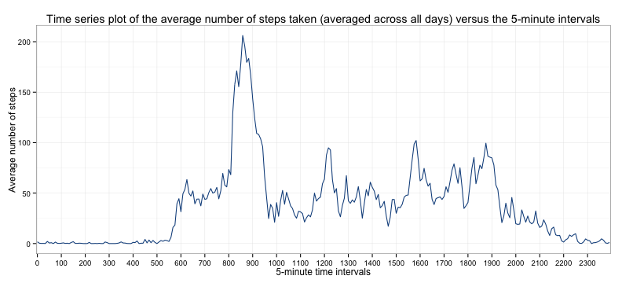
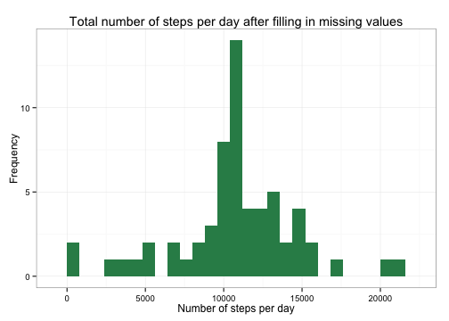
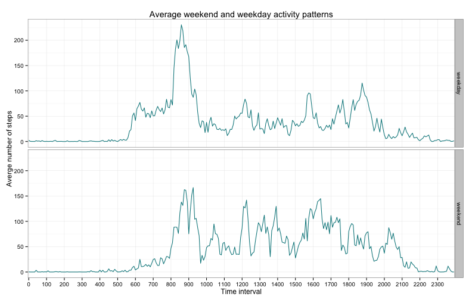

# Reproducible Research: Peer Assessment 1
1. This analysis uses `plyr` and `ggplot2` packages
2. It uses the [Activity monitoring data](https://d396qusza40orc.cloudfront.net/repdata%2Fdata%2Factivity.zip), which is expected to be located in the working directory.

```r
library(plyr)
library(ggplot2)
```


## 1. Loading and preprocessing the data
First we unzip the archive and load the data, and then perform some prepocessing:
* The `date` variable is transformed into `Date` format.
* The `interval` variable is transformed into a `factor`. 

The reason for turning `interval` to `factor` format is that the 5-minute intervals are coded as hour number plus the 5 minutes. In this way the interval starting, for example, at midnight, is coded as 0, the one starting at 00:05 is coded as 5, and so on with 5-minute increments. However the interval starting at 00:55 will be 55, but the next one, starting at 01:00 is coded as 100. Thus, if the intervals are treated as integers, at the beginning of each new hour there is a sort of a jump, an increment of 45 instead of 5. 

Later in the analysis we will be inspecting daily activity patterns on plots and I would like to have continuous plots without these odd jumps at the start of each hour. Therefor **I am going to treat the interval codes as factors for the purpose of this research.**


```r
unzip("activity.zip")
activity <- read.csv("activity.csv", stringsAsFactors = F)
activity$date <- as.Date(activity$date)
activity$interval <- as.factor(activity$interval)
```


## 2. What is mean total number of steps taken per day?
We will first use the `ddply` function from the `plyr` package to create a summary dataframe `activityTotal` which will contain the sum of steps for each day. We will ignore the `NA` values for this part of the analysis (i.e. consider them to equal zero).

Afterward we will plot a histogram of this summary dataframe with the `ggplot` function.

```r
activityTotal <- ddply(activity, .(date), summarise, stepsSum = sum(steps, na.rm = T))
ggplot(activityTotal, aes(x = stepsSum)) + geom_histogram(fill = "dodgerblue4", 
    binwidth = 800) + xlab("Number of steps per day") + ylab("Frequency") + 
    ggtitle("Total number of steps per day") + theme_bw()
```

 


Using this summary dataframe we can calculate the **mean** total number of steps taken per day:

```r
mean(activityTotal$stepsSum)
```

```
## [1] 9354
```

And the **median** total number of steps taken per day:

```r
median(activityTotal$stepsSum)
```

```
## [1] 10395
```

The **mean** is noticeable lower than the **median** which suggests right-skewedness of the data, and this is what we observe on the plot. A significant amount of days appear to have 0 or close to 0 total number of steps. Alternatively these could have been the days with a lot or all observations missing, but we'll deal with this a bit later.

## 3. What is the average daily activity pattern?
We will make another summary dataframe, `activityAvg` which will contain the mean number of steps for each interval across all days.

We will then make a time series plot with this new dataframe. Since the `interval` variable had been converted to `factor`, by default `ggplot` will show all the 288 of its levels on the x-axis. Having 288 ticks is neither pretty nor convenient, so we will adjust the appearence of the x-axis manually and only display the ticks at the beginning of each hour, reducing their number to 24.

```r
activityAvg <- ddply(activity, .(interval), summarize, stepsAvg = mean(steps, 
    na.rm = T))
ggplot(activityAvg, aes(x = interval, y = stepsAvg, group = 1)) + geom_line(color = "dodgerblue4") + 
    scale_x_discrete(breaks = as.character(seq(0, 2300, 100))) + xlab("5-minute time intervals") + 
    ylab("Average number of steps") + ggtitle("Time series plot of the average number of steps taken (averaged across all days) versus the 5-minute intervals") + 
    theme_bw()
```

 


### 5-minute inerval with the maximum average number of steps
We can now find out which interval contains the maximum average number of steps.

```r
activityAvg$interval[activityAvg$stepsAvg == max(activityAvg$stepsAvg)]
```

```
## [1] 835
## 288 Levels: 0 5 10 15 20 25 30 35 40 45 50 55 100 105 110 115 120 ... 2355
```


It appears that the 5-minute interval that, on average, contains the maximum number of steps is **`835`**. A morning jog perhaps?


## 4. Imputing missing values

First we will calculate the number of rows containing `NA` values.

```r
nrow(activity[is.na(activity$steps), ])
```

```
## [1] 2304
```

There is 2304 rows with `NA` in them that we need to fill.

### Strategy for imputing missing data
Since we already have the mean number of steps for each interval calculated and stored in the `activityAvg` dataframe, we will use this data to fill the missing values.

We will extract the `NA` values together with their dates and intervals into a separate dataframe `stepsNA`. Then we will run a loop replacing the `NA` values with the average value for the corresponding 5-minute interval from `activityAvg`.

After that we will make a copy of our main dataframe `activity` and fill the missing values from `stepsNA`, obtaining a dataframe `activityImpute` which will have no missing values.


```r
stepsNA <- activity[is.na(activity$steps), ]
for (i in 1:nrow(activityAvg)) {
    interval <- activityAvg$interval[i]
    stepsNA$steps[stepsNA$interval == interval] <- activityAvg$stepsAvg[i]
}
activityImpute <- activity
activityImpute$steps[is.na(activityImpute$steps)] <- stepsNA$steps
```


### Histogram after filling in missing values
We now have a new dataframe `activityImpute` with missing values replaced by the average number of steps for the corresponding interval. 

We will now make a summary dataframe form it and then create a histogram from this new dataframe.

```r
actvImpTotal <- ddply(activityImpute, .(date), summarise, stepsSum = sum(steps))
ggplot(actvImpTotal, aes(x = stepsSum)) + geom_histogram(fill = "seagreen", 
    binwidth = 800) + xlab("Number of steps per day") + ylab("Frequency") + 
    ggtitle("Total number of steps per day after filling in missing values") + 
    theme_bw()
```

 

### Mean and median after filling in missing values
**Mean** number of steps per day after filling in missing values:

```r
mean(actvImpTotal$stepsSum)
```

```
## [1] 10766
```

**Median** number of steps per day after filling in missing values:

```r
median(actvImpTotal$stepsSum)
```

```
## [1] 10766
```

We can observe that after filling in missing values the total number of steps per day had increased on average. Furthermore, the mean and the median are now equal.

## 5. Are there differences in activity patterns between weekdays and weekends?
We will add a new 2-level factor variable `weekday` to the `activityImpute` dataframe which will indicate whether the day is a weekend or a weekday.

```r
activityImpute$weekday[weekdays(activityImpute$date) == "Sunday" | weekdays(activityImpute$date) == 
    "Saturday"] <- "weekend"
activityImpute$weekday[is.na(activityImpute$weekday)] <- "weekday"
activityImpute$weekday <- factor(activityImpute$weekday)
```


Then we will make a new summary dataframe `actvDays` which will contain the average number of steps for each interval separately for weekends and weekdays, and then make a 2-panel plot of the resulting data.

```r
actvDays <- ddply(activityImpute, .(interval, weekday), summarise, stepsAvg = mean(steps))
ggplot(actvDays, aes(x = interval, y = stepsAvg, group = 1)) + facet_grid(weekday ~ 
    .) + geom_line(color = "turquoise4") + scale_x_discrete(breaks = as.character(seq(0, 
    2300, 100))) + xlab("Time interval") + ylab("Averge number of steps") + 
    ggtitle("Average weekend and weekday activity patterns") + theme_bw()
```

 

We can see that the daily activity pattern is indeed different for weekdays and weekends.

The prominent peak between 8 AM and 9 AM clearly visible on the weekday plot is absent on the weekends plot. However for the rest of the day the subject seems to have been more active on weekends, with quite a few intervals reaching up to almost 150 steps, while on weekdays most intervals barely approached 50 to 100 steps.
