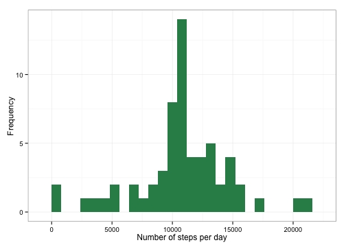
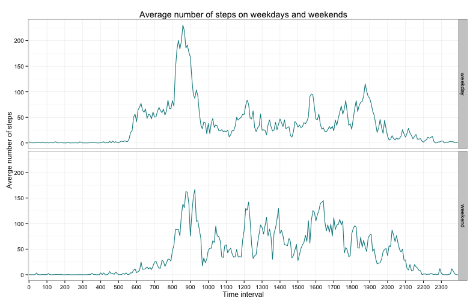

First we load the packages ```plyr``` and ```ggplot2``` which will be required for the analysis.

The we load the data and transform the date variable into ```Date``` format, and interval into a factor. 
The reason for turning interval to factor is that the 5-minute intervals are essentially coded as hour plus the 5 minutes, so that for 00:55 the interval is 55, and for 1:00 is is 100. Thus if the intervals are treated as integers this causes "leaps" on plots, because there are no intervals for 60, 70 and so on, but they are displayed in the x-axis.

Since we are inspecting the daily activity pattern I consider these jumps to be a flaw and want to get rid of them. Turning the intervals into factors will get rid of these jumps and show a continuous daily activity pattern.


```r
library(plyr)
library(ggplot2)
activity <- read.csv("activity.csv", stringsAsFactors = F)
activity$date <- as.Date(activity$date)
activity$interval <- as.factor(activity$interval)
```


## What is mean total number of steps taken per day?

We will first use the ```ddply``` function from the ```plyr``` package to cretae a summary dataframe ```activityTotal``` which will contain the sum of steps for each day. We will ignore the NA values for this part of the analysis.

Afterward we will plot a histogram of this summary dataframe.

```r
## Making a summary dataframe ignoring the NA values
activityTotal <- ddply(activity, .(date), summarise, stepsSum = sum(steps, na.rm = T))
## Making a histogram of total number of steps per day
ggplot(activityTotal, aes(x = stepsSum)) + geom_histogram(fill = "dodgerblue4", 
    binwidth = 800) + xlab("Number of steps per day") + ylab("Frequency") + 
    ggtitle("Total number of steps per day") + theme_bw()
```

 


We can view the mean and the median.

```r
## Mean number of steps per day
mean(activityTotal$stepsSum)
```

```
## [1] 9354
```

```r
## Median number of steps per day
median(activityTotal$stepsSum)
```

```
## [1] 10395
```


## What is the average daily activity pattern?
We will make another smmary dataframe, `activityAvg` which will contain the mean number of steps for each interval across all days.

We will then make a time series plot of this new dataframe.

```r
## Computing mean number of steps
activityAvg <- ddply(activity, .(interval), summarize, stepsAvg = mean(steps, 
    na.rm = T))
## Plotting
ggplot(activityAvg, aes(x = interval, y = stepsAvg, group = 1)) + geom_line(color = "dodgerblue4") + 
    scale_x_discrete(breaks = as.character(seq(0, 2300, 100))) + xlab("Time interval") + 
    ylab("Averge number of steps") + theme_bw()
```

 


### 5-minute inerval with the maximum average number of steps
We can now find out which interval contains the maximum average number of steps.

```r
activityAvg$interval[activityAvg$stepsAvg == max(activityAvg$stepsAvg)]
```

```
## [1] 835
## 288 Levels: 0 5 10 15 20 25 30 35 40 45 50 55 100 105 110 115 120 ... 2355
```


It appears that the 5-minute interval that, on average, contains the maximum number of steps is **`835`**.

## Imputing missing values
First we will calculate the number of rows containing `NA` values.

```r
nrow(activity[is.na(activity$steps), ])
```

```
## [1] 2304
```

There is 2304 rows with `NA` in them that we need to fill.

### Using interval average to impute missing values
Since we already have the mean number of steps for each interval calculated and stored in the `activityAvg` dataframe, we will use this data to fill the missing values.


```r
## Extract the NA values with corresponding interval codes into a separate
## dataframe stepsNA.  Use the average value of each interval from the
## previously created activityAvg to fill the missing values in the stepsNA
## dataframe
stepsNA <- activity[is.na(activity$steps), ]
for (i in 1:nrow(activityAvg)) {
    interval <- activityAvg$interval[i]
    stepsNA$steps[stepsNA$interval == interval] <- activityAvg$stepsAvg[i]
}
## Copy the activity dataframe to the new dataframe, activityImpute Use the
## values from stepsNA to fill missing values in activityImpute
activityImpute <- activity
activityImpute$steps[is.na(activityImpute$steps)] <- stepsNA$steps
```


### Histogram after filling in missing values
We now have a new dataframe `activityImpute` with missing values replaced by the average number of steps for the corresponding interval. 

We will now make a summary dataframe form it and then create a histogram from this new dataframe.

```r
## Summarizing the filled dataframe
actvImpTotal <- ddply(activityImpute, .(date), summarise, stepsSum = sum(steps))
## Making a histogram
ggplot(actvImpTotal, aes(x = stepsSum)) + geom_histogram(fill = "seagreen", 
    binwidth = 800) + xlab("Number of steps per day") + ylab("Frequency") + 
    theme_bw()
```

 

### Mean and median after filling in missing values
We can also take a look at the mean and the median of this dataframe.

```r
## Mean number of steps per day after filling in missing values
mean(actvImpTotal$stepsSum)
```

```
## [1] 10766
```

```r
## Median number of steps per day after filling in missing values
median(actvImpTotal$stepsSum)
```

```
## [1] 10766
```


## Are there differences in activity patterns between weekdays and weekends?
We will add a new variable `weekday` to the `activityImpute` dataframe which will indicate whether the day was a weekend or a weekday.

```r
## Set weekday variable to 'weekend' if the value in date corresponds to
## Saturday or Sunday Set it to 'weekday' for all other days Convert it to a
## factor
activityImpute$weekday[weekdays(activityImpute$date) == "Sunday" | weekdays(activityImpute$date) == 
    "Saturday"] <- "weekend"
activityImpute$weekday[is.na(activityImpute$weekday)] <- "weekday"
activityImpute$weekday <- factor(activityImpute$weekday)
```


Then we will make a new summary dataframe `actvDays` which will contain the average number of steps for each interval separately for weekends and weekdays, and then make a 2-panel plot of the resulting data.

```r
## Summarizing the dataframe
actvDays <- ddply(activityImpute, .(interval, weekday), summarise, stepsAvg = mean(steps))
## Plotting
ggplot(actvDays, aes(x = interval, y = stepsAvg, group = 1)) + facet_grid(weekday ~ 
    .) + geom_line(color = "turquoise4") + scale_x_discrete(breaks = as.character(seq(0, 
    2300, 100))) + xlab("Time interval") + ylab("Averge number of steps") + 
    ggtitle("Average number of steps on weekdays and weekends") + theme_bw()
```

 

