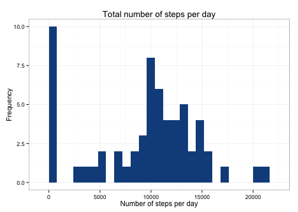

First we load the packages ```plyr``` and ```ggplot2``` which will be required for the analysis.

The we load the data and transform the date variable into ```Date``` format, and interval into a factor. 
The reason for turning interval to factor is that the 5-minute intervals are essentially coded as hour plus the 5 minutes, so that for 00:55 the interval is 55, and for 1:00 is is 100. Thus if the intervals are treated as integers this causes "leaps" on plots, because there are no intervals for 60, 70 and so on, but they are displayed in the x-axis.

Since we are inspecting the daily activity pattern I consider these jumps to be a flaw and want to get rid of them. Turning the intervals into factors will get rid of these jumps and show a continuous daily activity pattern.


```r
library(plyr)
library(ggplot2)
activity <- read.csv("activity.csv", stringsAsFactors = F)
activity$date <- as.Date(activity$date)
activity$interval <- as.factor(activity$interval)
```


## What is mean total number of steps taken per day?

We will first use the ```ddply``` function from the ```plyr``` package to cretae a summary dataframe ```activityTotal``` which will contain the sum of steps taken each day.

Afterward we will plot a histogram of this summary dataframe.

```r
activityTotal <- ddply(activity, .(date), summarise, stepsSum = sum(steps, na.rm = T))
ggplot(activityTotal, aes(x = stepsSum)) + geom_histogram(fill = "dodgerblue4", 
    binwidth = 800) + xlab("Number of steps per day") + ylab("Frequency")
```

 


## What is the average daily activity pattern?

```r
activityAvg <- ddply(activity, .(interval), summarize, stepsAvg = mean(steps, 
    na.rm = T))
activityAvg$interval <- factor(activityAvg$interval)

ggplot(activityAvg, aes(x = interval, y = stepsAvg, group = 1)) + geom_line(color = "dodgerblue4") + 
    scale_x_discrete(breaks = as.character(seq(0, 2300, 100))) + xlab("Time interval") + 
    ylab("Averge number of steps")
```

 

```r

activityAvg$interval[which.max(activityAvg$stepsAvg)]
```

```
## [1] 835
## 288 Levels: 0 5 10 15 20 25 30 35 40 45 50 55 100 105 110 115 120 ... 2355
```


## Imputing missing values

```r
nrow(activity[is.na(activity$steps), ])
```

```
## [1] 2304
```

```r

stepsNA <- activity[is.na(activity$steps), ]
for (i in 1:nrow(activityAvg)) {
    interval <- activityAvg$interval[i]
    stepsNA$steps[stepsNA$interval == interval] <- activityAvg$stepsAvg[i]
}

activityImpute <- activity
activityImpute$steps[is.na(activityImpute$steps)] <- stepsNA$steps

actvImpTotal <- ddply(activityImpute, .(date), summarise, stepsSum = sum(steps))

ggplot(actvImpTotal, aes(x = stepsSum)) + geom_histogram(fill = "seagreen", 
    binwidth = 800) + xlab("Number of steps per day") + ylab("Frequency")
```

 

```r
summary(actvImpTotal$stepsSum)
```

```
##    Min. 1st Qu.  Median    Mean 3rd Qu.    Max. 
##      41    9820   10800   10800   12800   21200
```


## Are there differences in activity patterns between weekdays and weekends?

```r
activityImpute$weekday[weekdays(activityImpute$date) == "Sunday" | weekdays(activityImpute$date) == 
    "Saturday"] <- "weekend"
activityImpute$weekday[is.na(activityImpute$weekday)] <- "weekday"
activityImpute$weekday <- factor(activityImpute$weekday)

actvDays <- ddply(activityImpute, .(interval, weekday), summarise, stepsAvg = mean(steps))

ggplot(actvDays, aes(x = interval, y = stepsAvg, group = 1)) + facet_grid(weekday ~ 
    .) + geom_line(color = "orangered4") + scale_x_discrete(breaks = as.character(seq(0, 
    2300, 100))) + xlab("Time interval") + ylab("Averge number of steps") + 
    ggtitle("Average number of steps on weekdays and weekends") + theme(strip.text = element_text(face = "bold", 
    size = rel(1.5)), strip.background = element_rect(fill = "lightblue"))
```

 

